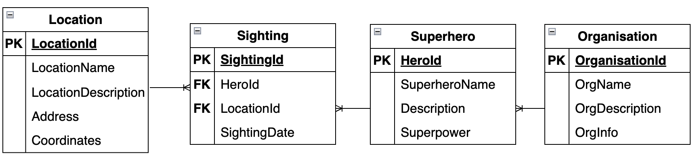
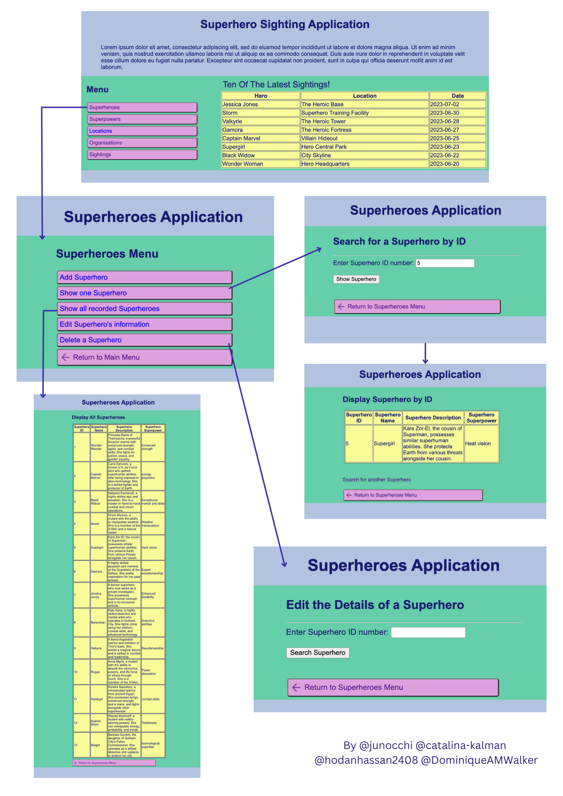
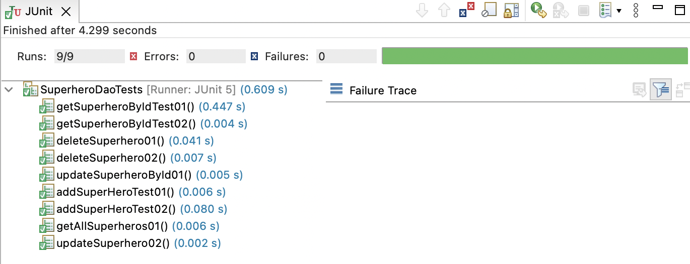

# superhero-java
A Superhero sightings web application, developed as part of a group of four junior developers.

 

 

## Tech
- Java Spring Boot with JDBC Template
- HTML
- CSS
- 1 database with 4 tables

## Part 1
With the rising popularity of superhero movies, there has been a heightened awareness of superheroes in our midst. The frequency of superhero (and supervillain) sightings is increasing at an alarming rate. Given this development, the Hero Education and Relationship Organisation (HERO) has asked our company to develop a database and data layer for their new superhero sightings web application.

The system has the following requirements:

- It keeps track of all superhero information.
- Heroes have names, descriptions, and a superpower.
- Heroes are affiliated with one or more superhero organisations.
- It keeps track of all location information:
- Locations have names, descriptions, address information, and latitude/longitude coordinates.
- It keeps track of all superhero organisation information:
- Organisations have names, descriptions, and address/contact information.
- Organisations have members.
- A user is able to record a superhero sighting for a particular location and date.
The system reports all of the superheroes sighted at a particular location.
The system reports all of the locations where a particular superhero has been seen.
The system reports all sightings (hero and location) for a particular date.
The system reports all of the members of a particular organisation.
The system reports all of the organisations a particular superhero belongs to.

# TDD
By prioritizing TDD, we ensured the reliability and stability of our application, instilling confidence in our team and stakeholders. Below is an example of the test cases we wrote for Superheroes: 
  
 
